# データベース設計

RecoForeJP のデータベーススキーマ設計ドキュメント。

## 構成方針

### 1 つの PostgreSQL インスタンスに 3 つの **schema**

| Schema  | 担当サービス                    | 役割                                             |
| ------- | ------------------------------- | ------------------------------------------------ |
| `users` | user-service (Java/Spring Boot) | アカウント・プロフィール・設定                   |
| `items` | item-service (Java/Spring Boot) | 推薦対象アイテム・カテゴリ・タグ・フィードバック |
| `ai`    | ai-service (Python/FastAPI)     | 埋め込みベクトル・検索履歴・推薦ログ             |

各サービスは **自分の schema 内のテーブルだけ** を参照／変更する。schema 間のテーブル参照は **論理 FK**（参照する側がアプリケーションで整合性を保つ）に留め、物理 FK は張らない。

### なぜ schema 分割なのか

| 方針                                         | 利点                                                         | 欠点                               |
| -------------------------------------------- | ------------------------------------------------------------ | ---------------------------------- |
| 1 DB / 1 schema（モノリス）                  | シンプル、トランザクション容易                               | サービス境界が曖昧、後で分けにくい |
| **1 DB / 複数 schema（採用）**               | サービス境界が論理的に明確、後で DB 分離が容易、運用コスト低 | クロス schema 強制制約は使えない   |
| サービスごとに DB 分離（純マイクロサービス） | 完全独立、スケール自由                                       | 運用コスト高、ローカル開発複雑     |

卒論 MVP のスケールではコスト/効果のバランスから **真ん中** を選択。将来、ベクトル DB の負荷が上がれば `ai` schema を別 DB に分離できる。

## ER 図

```mermaid
erDiagram
    USERS ||--o| USER_PROFILES : "has 1"
    USERS ||--o| USER_PREFERENCES : "has 1"
    USERS ||--o{ USER_INTERESTS : "has many"

    CATEGORIES ||--o{ ITEMS : "categorizes"
    CATEGORIES ||--o{ CATEGORIES : "parent (self-ref)"
    ITEMS ||--o{ ITEM_TAGS : "tagged with"
    TAGS ||--o{ ITEM_TAGS : "applies to"
    ITEMS ||--o{ ITEM_LANGUAGES : "supports"

    USERS ||--o{ FEEDBACKS : "gives (logical FK)"
    ITEMS ||--o{ FEEDBACKS : "receives"

    USERS ||--o| USER_EMBEDDINGS : "vectorized as (logical FK)"
    ITEMS ||--o| ITEM_EMBEDDINGS : "vectorized as (logical FK)"
    USERS ||--o{ SEARCH_QUERIES : "issues (logical FK)"
    USERS ||--o{ RECOMMENDATION_LOGS : "shown (logical FK)"
    ITEMS ||--o{ RECOMMENDATION_LOGS : "recommended (logical FK)"

    USERS {
        uuid id PK
        string email UK
        string password_hash
        string nationality "ISO 3166-1 alpha-2"
        string native_language "BCP47"
        timestamptz created_at
    }

    USER_PROFILES {
        uuid user_id PK,FK
        string japanese_level "N1..N5"
        string residency_status
        string occupation
        string region
        date arrival_date
        string life_stage "arrival/settled/established"
    }

    USER_INTERESTS {
        uuid user_id PK,FK
        string interest PK
    }

    USER_PREFERENCES {
        uuid user_id PK,FK
        string preferred_language
        bool notification_enabled
    }

    CATEGORIES {
        int id PK
        string slug UK
        string name_ja
        string name_en
        int parent_id FK "self-ref"
    }

    ITEMS {
        uuid id PK
        int category_id FK
        string title
        text description
        string url
        string region
        string source
        string min_japanese_level
        jsonb metadata
        timestamptz published_at
        timestamptz expires_at
    }

    TAGS {
        int id PK
        string name UK
    }

    ITEM_TAGS {
        uuid item_id PK,FK
        int tag_id PK,FK
    }

    ITEM_LANGUAGES {
        uuid item_id PK,FK
        string language PK
    }

    FEEDBACKS {
        bigserial id PK
        uuid user_id "logical FK -> users.users"
        uuid item_id FK
        string feedback_type "view/click/favorite/rating"
        smallint rating "1..5, nullable"
        timestamptz created_at
    }

    USER_EMBEDDINGS {
        uuid user_id PK "logical FK -> users.users"
        vector embedding "384-dim"
        timestamptz updated_at
    }

    ITEM_EMBEDDINGS {
        uuid item_id PK "logical FK -> items.items"
        vector embedding "384-dim"
        timestamptz updated_at
    }

    SEARCH_QUERIES {
        bigserial id PK
        uuid user_id "logical FK"
        text query
        string language
        vector embedding "384-dim"
        timestamptz created_at
    }

    RECOMMENDATION_LOGS {
        bigserial id PK
        uuid user_id "logical FK"
        uuid item_id "logical FK"
        real score
        text reason
        string algorithm "content/collaborative/hybrid/llm"
        timestamptz shown_at
        timestamptz clicked_at
    }
```

## 命名規約

- **schema 名**: 単数形小文字（`users`, `items`, `ai`）
- **テーブル名**: 複数形 snake_case（`user_profiles`）
- **主キー**: `id`（または複合キー）
- **外部キー**: `<参照先テーブル単数形>_id`（例: `user_id`, `item_id`）
- **タイムスタンプ**: `TIMESTAMPTZ`（タイムゾーン付き）、`created_at` / `updated_at`
- **UUID**: ユーザー・アイテムなど外部公開するエンティティの主キー（推測されにくい）
- **SERIAL / BIGSERIAL**: 内部用のカテゴリ・タグ・ログなど

## 設計のポイント

### ユーザー属性

論文の 3.2 ユーザモデル設計に対応：

| 属性                 | 場所                     | カラム                           |
| -------------------- | ------------------------ | -------------------------------- |
| 言語優先度           | `users.user_preferences` | `preferred_language`             |
| 国籍・母語           | `users.users`            | `nationality`, `native_language` |
| 滞在目的（在留資格） | `users.user_profiles`    | `residency_status`               |
| 日本語能力レベル     | `users.user_profiles`    | `japanese_level`                 |
| 興味カテゴリ         | `users.user_interests`   | `interest`                       |
| 居住地域             | `users.user_profiles`    | `region`                         |
| 生活段階             | `users.user_profiles`    | `life_stage`                     |
| 来日日               | `users.user_profiles`    | `arrival_date`                   |

### アイテムとフィードバック

- `items.items.metadata`（JSONB）はカテゴリごとに違う構造を持つ情報の置き場所（例：求人なら時給、住居なら家賃）
- `items.feedbacks.feedback_type`：論文の「閲覧」「クリック」「お気に入り」「評価」をひとつのテーブルに集約

### ベクトル検索（ai schema）

- `vector(384)`：`intfloat/multilingual-e5-small` を想定（384次元、多言語対応、軽量）
- HNSW インデックス（pgvector が対応）でコサイン類似度検索
- ユーザーとアイテムの埋め込みを別テーブルにすることで、片方の再生成が他方に影響しない

## 関連ドキュメント

- [tables.md](./tables.md) — テーブルごとの詳細な列定義
- [sample-ddl.sql](./sample-ddl.sql) — リファレンス用 DDL（実際のマイグレーションは RECO-11 で作成）
